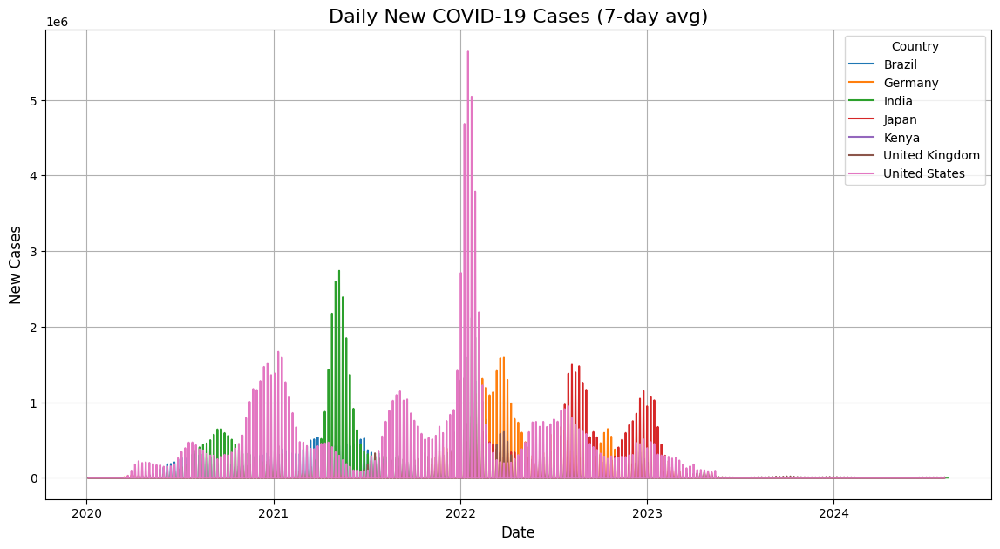
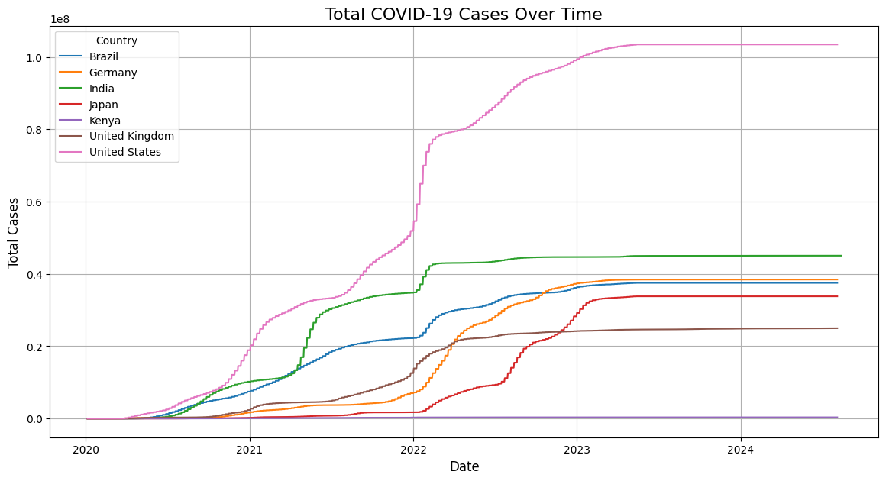

# COVID-19 Global Trends Analysis

## Project Overview
This project provides an in-depth analysis of global COVID-19 trends using data from [Our World in Data](https://ourworldindata.org/coronavirus). It focuses on understanding the spread of the virus, its impact on different countries, and vaccination progress. The project includes data cleaning, exploratory analysis, interactive visualizations, and insight generation.

---

## Objectives
- To analyze COVID-19 cases, deaths, and vaccination trends globally.
- To generate comparative insights across countries.
- To create interactive visualizations for better data exploration.
- To highlight key insights, such as countries with the highest cases, deaths, and vaccination rates.

---

## Tools and Libraries Used
The project is implemented in Python and uses the following libraries:
- **`pandas`**: For data manipulation and cleaning.
- **`numpy`**: For numerical computations.
- **`matplotlib`**: For static visualizations.
- **`seaborn`**: For enhanced data visualization.
- **`plotly`**: For interactive visualizations.
- **`kaleido`**: For saving Plotly visualizations as images.
- **`IPython`**: For displaying Markdown in Jupyter Notebook.

---

## How to Run the Project
1. **Clone or Download the Project**:
   - Clone the repository or download the project files to your local machine.

2. **Install Dependencies**:
   - Ensure Python 3.7 or higher is installed.
   - Install the required libraries using:
     ```bash
     pip install pandas numpy matplotlib seaborn plotly kaleido ipython
     ```

3. **Run the Script**:
   - Execute the script using:
     ```bash
     python covid_19_analysis.py
     ```

4. **View Results**:
   - The script will generate and save the following:
     - Static plots as PNG files.
     - Interactive maps as HTML files.
     - Cleaned data as a CSV file.
   - Open the HTML files in a browser to explore the interactive maps.

---

## Insights and Reflections
- **Key Insights**:
  - Countries with the highest cases and deaths are highlighted.
  - Vaccination progress is visualized to show global trends.
  - Mortality rates are analyzed to identify countries with the highest impact.

- **Reflections**:
  - This project demonstrates the importance of data visualization in understanding global health crises.
  - Interactive maps provide an engaging way to explore data and identify patterns.
  - The analysis can be extended to include additional metrics or regional breakdowns.

---

## Outputs
The following files are generated:
- **Static Plots**:
  - `total_cases_over_time.png`
  - `daily_new_cases.png`
  - `cases_per_million.png`
  - `deaths_per_million.png`
- **Interactive Maps**:
  - `cases_per_million_map.html`
  - `deaths_per_million_map.html`
- **Cleaned Data**:
  - `covid_analysis_results.csv`
- **Output examples**:
  



---


## Acknowledgments
- Data Source: [Our World in Data](https://ourworldindata.org/coronavirus)
- Libraries: `pandas`, `numpy`, `matplotlib`, `seaborn`, `plotly`